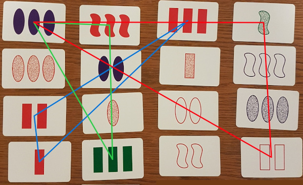

## Set Solver
This application automatically solves the game of Set. If you are not familiar with this game, take a look at their [website](https://www.setgame.com) or [Wikipedia](https://en.wikipedia.org/wiki/Set_(card_game).
 
 The project combines the strengths of computer vision and machine learning, using OpenCV and DL4J.

#### How it works
When given an input image or stream, the application identifies the cards. The idea is to place the webcam above the table, pointing downwards, so that all cards fit on the captured image.

First, all individual card images are extracted from the input image. Then, a trained model classifies each image. A simple algorithm determines which of these cards form sets with each other. The input image is overlaid with colored lines, indicating the sets.

Not that on this image, there are in fact 10 different possible sets. Drawing all these lines would give a colorful but messy spiderweb. Therefore, the draw limit can be configured. 

#### Purpose of the project
If you are bad at this game, your annoying little brother is always faster than you, and you are willing to trade your integrity for sweet revenge, then this application is your servant. Make sure you hide the webcam well, and position the screen in such a way that only you can see it, to prevent getting caught!

And if nobody turns out to have such a dark conscious, then the project has still served as a fun way to play with computer vision and machine learning, resulting into a cool demo application.   

